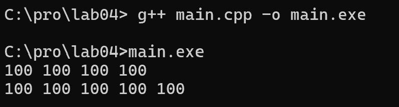
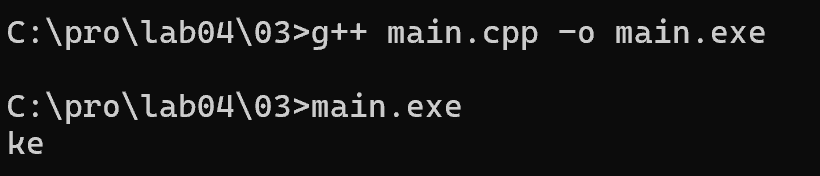
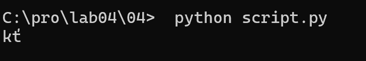
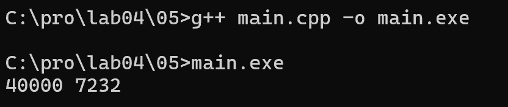
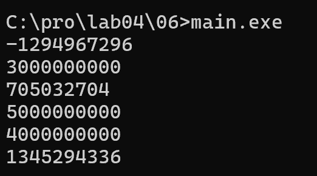
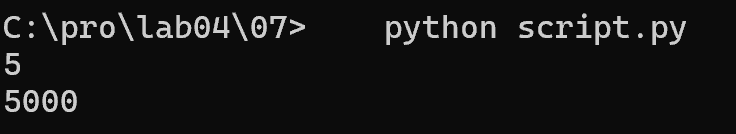
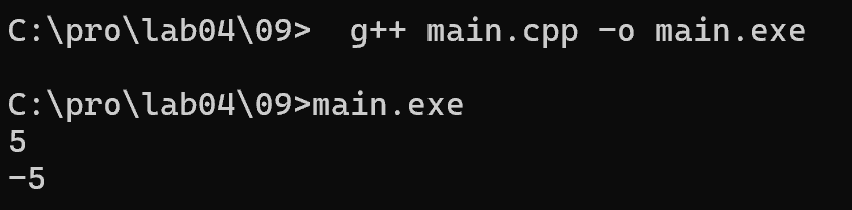

# Языки программирования
## Лабораторная работа 4

### Задание 1 **(3)**
* *Запишите двоичное представление числа -99 в целочисленном знаковом типе длиной 1, 2, 4 байта.* 

* 1 байт (n=8):   2^8 - 99 = 256 - 99 = 157 = 1001 1101
* 2 байта (n=16): 2^16 - 99 = 65536 - 99 = 65437 = 1111 1111 1001 1101
* 4 байта (n=32): 2^32 - 99 = 4294967296 - 99 = 4294967197 = 1111 1111 1111 1111 1111 1111 1001 1101

* *Запишите литералы равные наибольшему и наименьшему числу в типе* **int** *в шестнадцатеричной записи.*

* Наибольшее число: 2^31 - 1 = 2147483647 = 0x7FFFFFFF
* Наименьшее число: -2^31 = -2147483648 = 0x80000000

* *Запишите двоичное представление символа "`#`" в типе* **char**.

* Код сивола `#` в ASCII `35`
* 35 = 0010 0011


### Задание 2 **(3)**
*Напишите пример программы на С++ с использованием целочисленных литералов в разных форматах записи, 
разной длины, знаковых и беззнаковых. 
Пример должен охватывать большинство способов записи целочисленных литералов.*

* Пример на C++: 

```
#include <iostream>

int main() {
    int a = 100;
    int b = 0x64;
    int c = 0144;
    int d = 0b1100100;

    unsigned int e = 100U;
    long f = 100L;
    unsigned long g = 100UL;
    long long h = 100LL;
    unsigned long long i = 100ULL;

    std::cout << a << " " << b << " " << c << " " << d << std::endl;
    std::cout << e << " " << f << " " << g << " " << h << " " << i << std::endl;

    return 0;
}
```



* Все переменные имеют значение 100, но записаны разными способами.


### Задание 3 **(2)**
*Объясните работу фрагмента программы на С++. В ходе объяснения следует использовать таблицу кодов символов.*
```
char a = 'a';
a = a + 10;
std::cout << a;
a = a + 250;
std::cout << a;
```


* Символ 'a' имеет код 97
* a = 97 + 10 = 107
* Код 107 = символ 'k', выводится 'k'
* a = 107 + 250 = 357
* В char хранится только 0...255, поэтому происходит переполнение: 357 mod 256 = 101
* Код 101 = символ 'e', выводится 'e' 


### Задание 4 **(2)**

*Перепишите программу из предыдущего задания на Python, используя функции* **chr** и **ord**.

```
a = 'a'

a = chr(ord(a) + 10)
print(a, end='')

a = chr(ord(a) + 250)
print(a)
```


*Почему ее вывод отличается от вывода программы на С++?*

* Функция ord(символ) возвращает код символа
* Функция chr(код) возвращает символ по коду

* ord('a') = 97, 97 + 10 = 107, chr(107) = 'k'
* ord('k') = 107, 107 + 250 = 357, chr(357) = 't''
* В Python нет типа char. Функция chr() работает с Unicode
(диапазон до 1114111) и НЕ применяет переполнение автоматически.
chr(357) возвращает символ Unicode с кодом 357 — это 't'', а не 'e'


### Задание 5. **(2)**

*Объясните работу фрагмента программы на С++. В частности, почему* $x+x-x=x$, *но при этом*
$(x\cdot 2)/2\neq x$? *В отчете надо привести вычисления, приводящие к ответу.*
```
unsigned short x = 40000;
unsigned short y = x + x;
unsigned short z = x * 2;
y = y - x;
z = z / 2;
std::cout << y << " " << z << std::endl;
```


* Тип unsigned short занимает 2 байта = 16 бит

`x = 40000`

`y = x + x = 40000 + 40000 = 80000`
Переполнение:
`80000 mod 65536 = 14464`
`y = 14464`

`z = x * 2 = 40000 * 2 = 80000`
Переполнение:
`80000 mod 65536 = 14464`
`z = 14464`

`y = y - x = 14464 - 40000 = -25536`
`-25536 + 65536 = 40000`
`y = 40000`
Потеря при сложении компенсируется при вычитании

`z = z / 2 = 14464 / 2 = 7232`
`z = 7232`
Потеря при умножении НЕ компенсируется при делении


### Задание 6 **(2)**

*Объясните работу фрагмента программы на С++. Если имеет место переполнение, 
то требуется найти точный ответ до запуска программы, а только потом сверить его с выводом.
В отчете надо привести вычисления, приводящие к ответу.*
```
std::cout << 2000000000 + 1000000000 << std::endl;
std::cout << 2000000000U + 1000000000U << std::endl;
std::cout << 2500000000U + 2500000000U << std::endl;
std::cout << 2500000000LL + 2500000000LL << std::endl;
std::cout << 20000U * 200000U << std::endl;
std::cout << 200000U * 200000U << std::endl;
```


* Тип int: 32 бита, диапазон -2147483648..2147483647
* Тип unsigned int: 32 бита, диапазон 0..4294967295
* Тип long long: 64 бита, диапазон до ~9.2*10^18

#1. `2000000000 + 1000000000 = 3000000000`
Максимум int = 2147483647. Переполнение.
`3000000000 - 2^32 = 3000000000 - 4294967296 = -1294967296`

#2. `2000000000U + 1000000000U = 3000000000`
Максимум unsigned int = 4294967295. Помещается.

#3. `2500000000U + 2500000000U = 5000000000`
Максимум unsigned int = 4294967295. Переполнение.
`5000000000 - 4294967296 = 705032704` 

#4. `2500000000LL + 2500000000LL = 5000000000`
Тип long long (64 бита). Помещается.

#5. `20000U * 200000U = 4000000000`
Максимум unsigned int = 4294967295. Помещается.

#6. `200000U * 200000U = 40000000000`
Максимум unsigned int = 4294967295. Переполнение.
`40000000000 mod 4294967296 = 1345294336`


 
### Задание 7 **(2)**

*Напишите программу на Python умножающую введенное число на 1000. В программе 
можно использовать только операторы сдвига и сложения. Циклы использовать нельзя. Из функций
можно использовать только* **input** *и* **print** *для ввода и вывода.*
```
x = int(input())
y = ...
print(y)
``` 
Сдвиг влево на n позиций соответствует умножению на `2^n`:
`x * 2^n = x << n`
Поэтому: 
`x * 1000 = (x << 9) + (x << 8) + (x << 7) + (x << 6) + (x << 5) + (x << 3)`

Пример для `5`:
`5 << 9 = 5 * 512 = 2560`
`5 << 8 = 5 * 256 = 1280 `
`5 << 7 = 5 * 128 = 640   `
`5 << 6 = 5 * 64  = 320 `
`5 << 5 = 5 * 32  = 160  `
`5 << 3 = 5 * 8   = 40 `

Сумма = `2560 + 1280 + 640 + 320 + 160 + 40 = 5000`
`5 * 1000 = 5000`
Совпадает




### Задание 8 **(2)**

*Найдите результаты вычисления следующих выражений без использования компьютера
или калькулятора. Процесс вычислений должен быть отображен в отчете.*
* `(1000 & 100) << 10`
* `(1000 >> 4) & 15`
* `~1234 + 1234`
* `(1000 ^ 500) & 63`
* `(100 << 3) + (100 >> 3)`

#1. `(1000 & 100) << 10`
`1000 = 1111101000`
`100  = 0001100100`

```
1111101000
0001100100
----------
0001100000 = 96
```
`96 << 10 = 96 * 1024 = 98304`

#2. `(1000 >> 4) & 15`
`1000 >> 4 = 1000 / 16 = 62`

```
62 = 111110
15 = 001111

111110
001111
------
001110
```
`001110 = 14`

#3. `~1234 + 1234`
Используем формулу:
`~x = -x - 1`
`~1234 = -1235`
`-1235 + 1234 = -1`

#4. `(1000 ^ 500) & 63`
```
1000 = 1111101000
 500 = 0111110100

1111101000
0111110100
----------
1000011100
```
`1000011100 = 540`


```
540 = 1000011100
 63 = 0000011111

1000011100
0000011111
----------
0000011100 
```
`0000011100 = 28`

#5. `(100 << 3) + (100 >> 3)`
`100 << 3 = 100 * 8 = 800`

`100 >> 3 = 100 / 8 = 12`

`800 + 12 = 812`


###  Задание 9 **(2)**
*Напишите программу на языке С++ для умножения заданного целого числа на* $-1$. *В программе можно использовать только сложение и битовые
операции. Условия, циклы, библиотечные функции использовать нельзя.*

```
#include <iostream>

int main() {
    int x;
    std::cin >> x;
    int y = ~x + 1;
    std::cout << y << std::endl;
    return 0;
}
```


Для смены знака используем формулу:
`-x = ~x + 1`

Оператор ~ инвертирует все биты числа, а +1 добавляет единицу
В результате получаем число с противоположным знаком

## Дополнительные задания

### Задание 1 **(3)**

*Какие значения можно присвоить целочисленной переменной* **x**,
*чтобы результатом выражения `x|(x+1)` стало число 895?
Найдите все значения без использования компьютерных вычислений. 
Обоснуйте ответ.*

### Задание 2 **(3)**

*Какие значения можно присвоить целочисленной переменной* **x**,
*чтобы результатом выражения `x&(x-1)` стало число 0?
Найдите все значения без использования компьютерных вычислений 
(среди них есть отрицательные числа). Обоснуйте ответ.*

### Задание 3 **(3)**
*Какие значения можно присвоить целочисленной переменной* **x**,
*чтобы результатом выражения `x|(2*x)` стало число 1975?
Найдите все значения без использования компьютерных вычислений. 
Обоснуйте ответ.*

### Задание 4 **(3)**
*Обоснуйте корректность работы программы "Разложение числа по степеням двойки" из лекции.
Требуется определить, что будет результатом выражения `x&-x`.*

### Задание 5 **(5)**
*Ответьте на вопросы по программе "Упаковка коротких чисел" из лекции.*

* *Можно ли указанным способом сохранить более 8 чисел? Обоснуйте ответ.*
* *Сколько чисел можно будет сохранить при изменении диапазона от 0 до 7? Обоснуйте ответ.*
* *В чем смысл <<магической>> константы 15 в тексте программы?*
* *Если по условию задачи надо будет сохранить только числа в интервале от 0 до 10, то следует ли заменить
эту константу на 10? Обоснуйте ответ.*

### Задание 6 **(3)**
*Рассмотрим следующую программу на языке Python. Сколько чисел она выводит в зависимости от введенного
значения* **x**? *Как полученные числа зависят от* **x**?
```
x = int(input())
i = x
while i>0:
   print(i)
   i = (i-1) & x
```	
